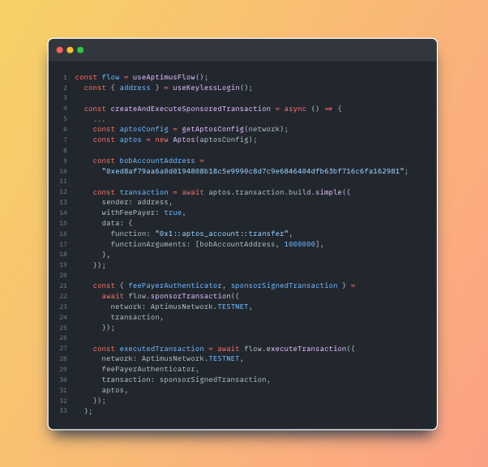

# Aptimus

As we begin a new phase in the **Blockchain industry**, it's important to ask:

> Where are we in the **development stage**? What are the **trends** driving dapps to achieve **Mass Adoption**?

**Web 2** meant *social media*, *APIs*, and the *internet of things*. People of all ages switched from PDAs and desktops to using the internet on small devices. Even your grandma could be seen posting bold comments on Facebook. Web 2 changed how people **adopted technology** while keeping it **easy to use**.

The average user is aware of the latest tech. They are very familiar with the internet and common technology. **Web 3** is struggling with big **UX problems** because users are used to very simple apps.

**Aptimus** was born to **simplify this journey**

  

### Aptimus Developer Portal: [aptimus](https://aptimus-fe.vercel.app/)

## Overview

Aptimus is a comprehensive ecosystem designed to simplify Aptos blockchain development and user experience. Our project consists of several key components:

1. **Backend API**: Manages sponsorship for addresses and modules, handles team member access,... and other functionalities.
2. **Frontend**: Aptimus Developer Portal for registering your dApp and get API keys.
3. **Gas Pool**: Manages and distributes gas fees efficiently.
4. **SDK** : Enables easy integration of Aptimus features into developer projects.
5. **Documentation**: Comprehensive guides and references for using Aptimus ecosystem.

Each component is maintained as a separate repository, allowing for modular development and easy updates.

## Features
- **Keyless Account**: Simplify user onboarding with our seamless keyless account system
- **Sponsor Transaction**: Enable gasless transactions for your users, reducing friction in dApp interactions.
- **Gas Pool**: Efficiently manage and distribute gas fees across multiple transactions with our dedicated gas pool system.
- **SaaS**: We'll handle all the thing for you (allow address, allow module to be sponsored, auto-scaling,...), allowing you to focus solely on your dApp's frontend and user experience.

## Interaction with SDK

# Roadmap
- [x] Q2 2024: Launch Beta version of Aptimus Developer Portal
- [x] Q2 2024: Release initial SDK with basic functionality
- [ ] Q3 2024: Develop and launch Gas Pool system
- [ ] Q4 2024: Release comprehensive documentation for all features
- [ ] Q1 2025: Launch full SaaS platform with auto-scaling capabilities
- [ ] Q1 2025: Implement advanced security features and audits
- [ ] Q2 2025: Expand SDK with additional integrations and tools
- [ ] Q3 2025: Implement cross-chain compatibility features
